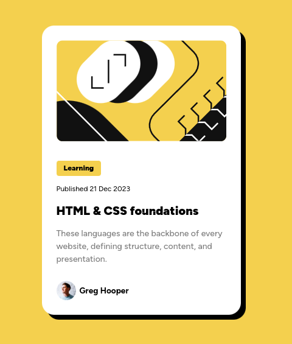

# Frontend Mentor - Blog preview card solution

## Table of contents

- [Overview](#overview)
  - [Screenshot](#screenshot)
  - [Links](#links)
- [My process](#my-process)
  - [Built with](#built-with)
  - [What I learned](#what-i-learned)
  - [Continued development](#continued-development)
  - [Useful resources](#useful-resources)
- [Author](#author)
- [Acknowledgments](#acknowledgments)

## Overview

### Screenshot

### Links

- Solution URL: https://github.com/surrealgee/blog-preview-card
- Live Site URL: https://surrealgee.github.io/blog-preview-card/

## My process

### Built with

HTML
CSS
BEM

### What I learned

I decided to use BEM for the first time. I think it's a really useful methodology.

I liked it because I don't have to struggle thinking about class names anymore, at leat for this small projects.

I would like to see how it will help me in the future when I work on bigger projects.

### Continued development

As this was just a small component this project it's finished as it is. Although if I learn something new that I can apply here I may come back to it.

### Useful resources

-https://fonts.google.com/specimen/Figtree
-https://www.figma.com/
-https://getbem.com/

## Author

- Website - https://github.com/surrealgee
- Frontend Mentor - https://www.frontendmentor.io/profile/surrealgee

## Acknowledgments

This is a solution to the [Blog preview card challenge on Frontend Mentor](https://www.frontendmentor.io/challenges/blog-preview-card-ckPaj01IcS). Frontend Mentor challenges help you improve your coding skills by building realistic projects.
